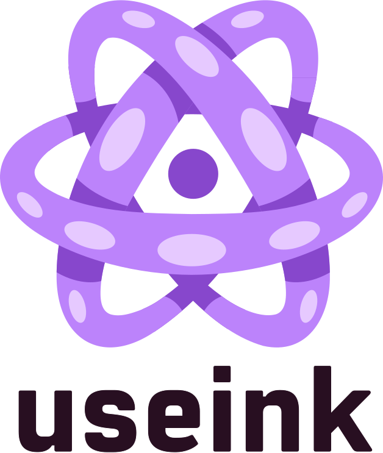

  
   
   
  
   
  
A React hook library for ink!

 

[![Element][k1]][k2] [![stack-exchange][s1]][s2]

[k1]: https://img.shields.io/badge/matrix-chat-brightgreen.svg?colorA=BC83FB&colorB=8747CC&style=flat
[k2]: https://matrix.to/#/#useink:parity.io

[s1]:
https://img.shields.io/badge/click-white.svg?logo=StackExchange&label=useink%20Support%20on%20StackExchange&colorA=BC83FB&colorB=8747CC
[s2]: https://substrate.stackexchange.com/questions/tagged/useink?tab=Votes

## Getting Started

* [Read the documentation](https://use.ink/frontend/overview)

* [Look at some examples](https://github.com/paritytech/useink/tree/main/playground)

## License

useInk! is [Apache licensed](LICENSE).

## Contributing

Contributions are welcome and appreciated! Check out the
[contributing guide](CONTRIBUTING.md) before you dive in.

## Code of Conduct

Everyone interacting in this repo is expected to follow the
[code of conduct](CODE_OF_CONDUCT.md).
